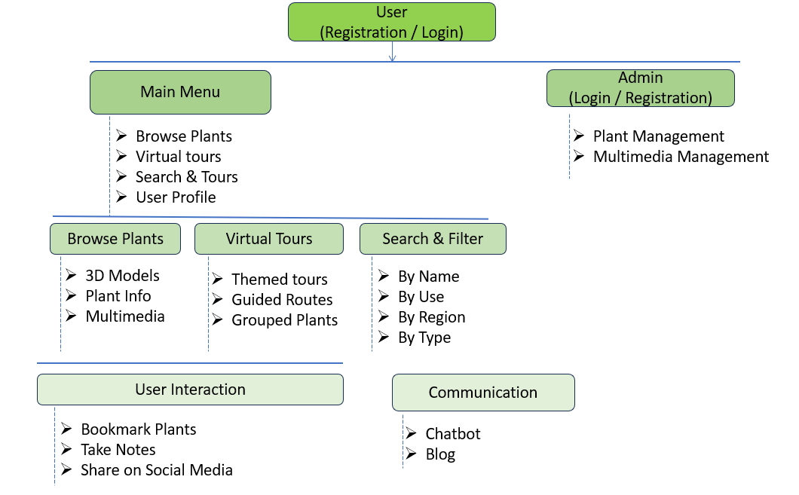

# Herbal-Garden
### FLOW CHART


# Virtual Herbal Garden 🌿

[](LICENSE)
[](https://github.com/yourusername/Virtual_Herbal_Garden/stargazers)

A web-based platform providing comprehensive knowledge about medicinal plants used in **AYUSH**.  

## Features

- **Smart Assistant / ChatBot**  
  Handles health queries and recognizes plant types from images to provide AYUSH-based medicinal insights.  

- **Herbs Encyclopedia**  
  Learning-focused encyclopedia highlighting therapeutic uses and natural health benefits of medicinal plants.  

- **Interactive Learning**  
  Includes quizzes and embedded 3D plant models to enhance engagement and understanding.  

## Tech Stack

- **Frontend:** HTML, CSS, JavaScript  
- **Backend / AI Integration:** (Mention if using any frameworks or APIs for ChatBot)  
- **3D Models:** Sketchfab embeds   

## Installation

1. Clone the repository:
```bash
git clone https://github.com/yourusername/Virtual_Herbal_Garden.git
